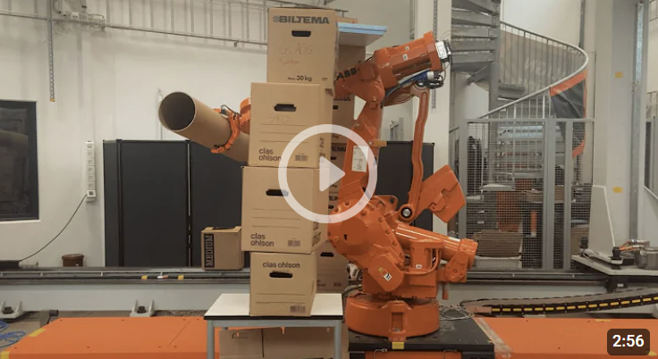

This thesis proposes a full pipeline autonomous pick-and-place procedure, integrating perception,
planning, grasping and control for execution of tasks towards long term industrial automation.
Within perception, we demonstrate the detection of a large object (target) including position and
orientation (pose) estimation in 3D world. Further on, obstacles in the work area are mapped with
proposed filtering prior to motion planning and navigation of an industrial robot to the target’s
pose. The target is then picked using a custom built motorized 3D printed end gripper, and placed
at a desired location in the robot’s reachable environment. Point cloud based model-free obstacle
avoidance is performed throughout the whole process. The complete pipeline is targeted towards
typical tasks in various industries including offshore, logistics and warehouse domain with scanning
of the scene, picking and placing of a bulky object from one position to another without or with
minimal human intervention.

The proposed methodology was tested upon the point cloud representation of the scene using a
network of six RGB-D cameras covering the entire working environment. The empirical results
together with the statistical analysis show that the proposed methodology is able to map the
environment of volume 10 m x 10 m x 5 m with lesser noise and determine the target position of
length 1.2 m with accuracy of 4.8 mm and precision of 3.6 mm from 10000 measurements.
Integrating the proposed object detection and localization, obstacle mapping and gripper with an
industrial robot resulted in a consistent, versatile and autonomous pick-and-place procedure. 30
successive tests with multiple obstacles and with the target object placed vertically, horizontally
and angled, displayed no collisions and 100% success rate on both gripping and placement of the
target.

The entire code developed in the project can be found on Github including links to CAD-files of
the gripper. A video demonstrating the complete pick-and-place procedure can be seen here or in
the URL below.

Github: [https://github.com/evenfl/p26_master](https://github.com/evenfl/p26_master)

Video: [https://youtu.be/1QShpxbUy2Q](https://youtu.be/1QShpxbUy2Q)

Read the entire thesis [here.](https://hdl.handle.net/11250/2826427)