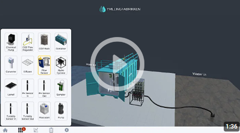

We published a research paper to Hawaii International Conference of System Sciences 2023 (HICSS). In this paper, we describe the framework that we used for this project. [Read the paper here.](https://hdl.handle.net/10125/103455)