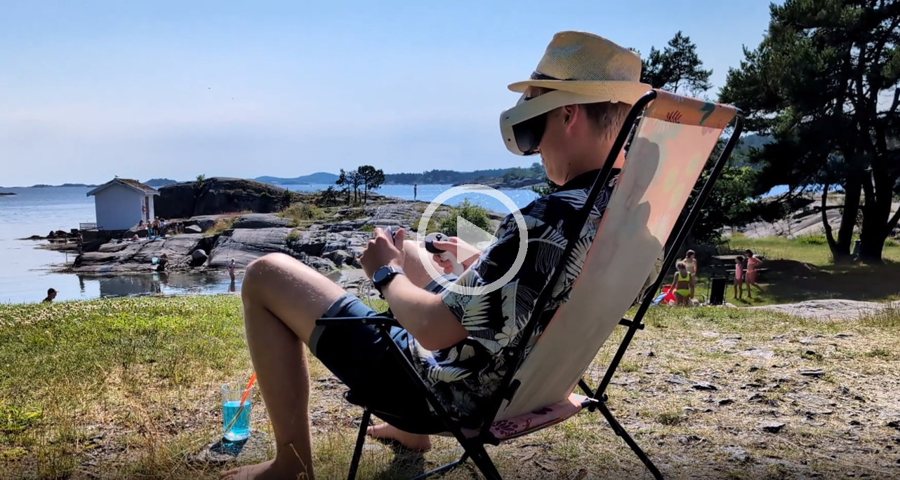

In my latest research, I've been exploring how we can make robots more accessible and easier to work with, especially in industrial settings.  The goal is to create a system where humans and robots can collaborate seamlessly, even when they're not in the same physical space.  This is where the concept of "digital twins" comes in, a virtual replica of real entities that you can interact with from your computer or even a VR headset. Below is a video demonstrating our work.

###### Building a Framework for Collaboration

Our research focuses on developing a framework that makes this kind of remote collaboration possible. This framework combines several technologies:

* Robot Operating System 2 (ROS 2): This provides the foundation for controlling the robot and managing communication between different components of the system.
* Node-RED: This tool helps process and visualize data from the robot, making it easier to understand what's happening.
* MQTT: This protocol enables secure and efficient communication between the digital twin and the physical robot, even over long distances.
* Virtual Reality (VR): This technology creates an immersive experience, allowing users to interact with the digital twin as if they were right there with the physical robot.

###### Real-World Applications: A Case Study

To test this framework, we used it to control a collaborative robot (cobot), a gripper and a conveyor belt in a simulated industrial environment.  The cobot was equipped with a camera and sensors, and we were able to monitor and control it remotely using a VR headset.  This demonstration showed how the framework could be used to perform tasks like picking and placing objects.

###### Benefits and Beyond

This research has the potential to transform the way we interact with robots. By enabling remote collaboration, we can make robots more accessible to people who may not be able to work in close proximity to them, such as individuals with disabilities. Additionally, this technology can improve safety by allowing humans to control robots from a safe distance in hazardous environments.

While this research is still ongoing, the results so far are promising. We believe that this framework has the potential to revolutionize the field of human-robot interaction, making it easier for us to work together with our robotic counterparts.

For the technically inclined: You can find the code for this project on my GitHub page: https://github.com/evenlangas/robot-control-virtual-reality-mqtt